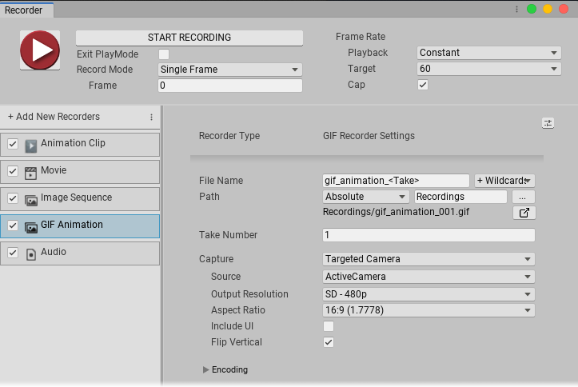

#  Configuring GIF Animation Recorders

The **GIF Animation Recorder** generates an animated .gif file.

This page covers properties specific to GIF Animation Recorders. To fully configure a GIF Animation Recorder, you must also set:

- The Recorder's [Output properties](RecorderProperties.md).
- The [Recording Properties](Recording.md) for the capture.

## GIF Animation Recorder properties

|Property:||Function:|
|:---|:---|:-|
| **Capture** ||Specifies the input for the recording.|
|| Targeted Camera |Records frames captured by a specific Camera, even if the Game View does not use that Camera.  Selecting this option displays the [Targeted Camera capture properties](#TargetedCamera).|
|| Render Texture Asset |Records frames rendered in a Render Texture.  Selecting this option displays the [Render Texture Asset capture properties](#RenderTextureAsset).|
|| Texture Sampling |Supersamples the **Source** camera during the capture to generate anti-aliased images in the recording. Use this capture method when the **Rendering Resolution** has the same or higher resolution than the **Output Resolution**.   Selecting this option displays the [Texture Sampling capture properties](#TextureSampling).|
| **Encoding** ||Properties for controlling the quality and size of the .gif output.|
|| _Num Colors_ |The number of colors used in the GIF palette table. The maximum is 256 colors. Specify a smaller palette to reduce the size of the .gif file while reducing image quality.|
|| _Keyframe Interval_ |The number of frames that share the same color palette. Increase this number to reduce the size of the .gif file while reducing image quality.|
|| _Max Tasks_ |The number of frames to encode in parallel. If you increase this number, it might reduce the amount of time Unity takes to encode the .gif file.|

[!include[<title>](InclCaptureOptionsTargetedCamera.md)]

[!include[<title>](InclCaptureOptionsRenderTextureAsset.md)]

[!include[<title>](InclCaptureOptionsTextureSampling.md)]
