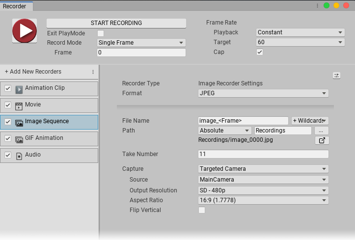

# Configuring Image Sequence Recorders

The **Image Sequence Recorder** generates a sequence of image files in the .jpeg, .png, or .exr (OpenEXR) file format.

This page covers properties specific to Image Sequence Recorders. To fully configure an Image Sequence Recorder, you must also set:

- The Recorder's [Output properties](RecorderProperties.md).
- The [Recording Properties](Recording.md) for the capture.

## Image Sequence Recorder Properties

|Property:||Function:|
|:---|:---|:-|
| **Format** ||The encoding format for Recorder output.   Choose **.png**, **.jpeg**, or **EXR** for .exr (OpenEXR).|
| **Capture Alpha** ||Controls whether or not the Recorder includes the Alpha channel in the recording.    This property is not available when you set **Format** to **.jpeg** or set **Capture** to **Game View**.|
| **Capture** ||Specifies the input for the recording.|
|| Game View |Records frames rendered in the Game View.  Selecting this option displays the [Game View capture properties](#GameView). |
|| Targeted Camera |Records frames captured by a specific Camera, even if the Game View does not use that Camera.  Selecting this option displays the [Targeted Camera capture properties](#TargetedCamera).|
|| 360 View |Records a 360-degree frame sequence.  Selecting this option displays the [360 View capture properties](#360View).|
|| Render Texture Asset |Records frames rendered in a Render Texture.  Selecting this option displays the [Render Texture Asset capture properties](#RenderTextureAsset).|
|| Texture Sampling |Supersamples the **Source** camera during the capture to generate anti-aliased images in the recording. Use this capture method when the **Rendering Resolution** has the same or higher resolution than the **Output Resolution**.   Selecting this option displays the [Texture Sampling capture properties](#TextureSampling).|

[!include[<title>](InclCaptureOptionsGameview.md)]

[!include[<title>](InclCaptureOptionsTargetedCamera.md)]

[!include[<title>](InclCaptureOptions360View.md)]

[!include[<title>](InclCaptureOptionsRenderTextureAsset.md)]

[!include[<title>](InclCaptureOptionsTextureSampling.md)]

