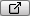

# Setting Recorder properties

To configure a Recorder, set its properties in the [Recorder window](RecorderWindow.md) or, if you're recording from a Timeline Track, in the [Recorder Clip Inspector](RecordingTimelineTrack.md).

From there, you can set the following types of properties:

- **Output Properties:** These specify the name, path, and other data for files the Recorder outputs. These are described below.  
- **Recorder-specific properties:** Each type of Recorder has additional properties you must set. For example, a Recorder that captures via a Camera needs to know which Camera to use.  Recorder-specific properties are described on the following pages:
  - [**Configuring Animation Clip Recorders**](RecorderAnimation.md)
  - [**Configuring Movie Recorders**](RecorderMovie.md)
  - [**Configuring Image Sequence Recorders**](RecorderImage.md)
  - [**Configuring GIF Animation Recorders**](RecorderGif.md)
  - [**Configuring Audio Recorders**](RecorderAudio.md)

After you set the Recorder's properties, you can save them as a [Recorder Preset](RecorderManage.md#creating-recorder-presets).

If you've already saved the configuration you want as a [Recorder Preset](RecorderManage.md#creating-recorder-presets), you can load it instead of setting the Recorder properties.

>[!NOTE]
>Recorder properties are not available in standalone Unity Players or builds.

## Output properties

These properties define file output options for any type of Recorder.

|Property:||Function:|
|:---|:---|:---|
| **File Name** ||The name of the output file.  Type a file name in the text field.  Use the **+Wildcards** drop-down menu to choose various auto-generated strings to include in the file name. |
| **+Wildcards** ||Lists placeholders for auto-generated text strings that the Recorder inserts in the **File Name**. For example, the date and time you generate the recording.  Choose a wildcard from the drop-down menu to add its placeholder to the text field. You can combine wildcards.  The Recorder replaces all placeholders with the correct text when it saves the output file.|
|   | \<Recorder\>  |The Recorder name, as it appears in the Recorder list.  |   
|   |\<Time\>   | The time the recording is generated. Uses the `00h00m` format. |   
|   |\<Take\>   | The **Take Number** value. Uses the `000` format.  |   
|   |\<Date\>   | The date the recording is generated. Uses the `yyyy-MM-dd` format.   |   
|   |\<Project\>   | The name of the current Unity Project.  |   
|   |\<Product\>   | A combination of the Unity Project name and the output file extension.  |   
|   |\<Scene\>   | The name of the current Unity Scene.  |   
|   |\<Resolution\>   | The output resolution in pixels.  |   
|   |\<Frame\>   | The current frame.  This is useful for Image Sequence Recorders that output each frame as a separate file.  |   
|   |\<Extension\>   | The file extension of the output format.  |   
| **Path** ||Use these controls to configure the path to the folder where the Recorder saves output files.  Some Recorders can only output to specific locations. For example Animation Clip Recorders can only output to locations inside the Assets folder.|
|   |_[DROP-DOWN]_  |  Choose one of several pre-defined Unity folders, or choose **Absolute** to specify a custom path.  |
|   | _[TEXT FIELD]_  | If you choose a predefined path from the drop-down menu, the Recorder appends anything you enter here to that path.  If you choose **Absolute** from the drop-down menu, you can enter the custom output path here.    If you click the Output Location button (**...**) to choose an absolute path from the Unity file browser, the path you choose overwrites anything in this field. |
|   | Output Location button (**...**) | Opens a Unity file browser where you can choose a custom output path. When you choose a path this way, the Recorder automatically sets the drop-down menu to **Absolute**.  |
|   | _[PATH]_  | Displays the full output path, as set in the **File Name** and **Path** properties. |
|   | File Browser button    | Opens your operating system's file browser to the current path.  |
|**Take Number**   || A value that the Recorder uses to number recordings. It increases by one after each recording.   You can use the **<Take>** wildcard to append current **Take** value to the **File Name**. |
