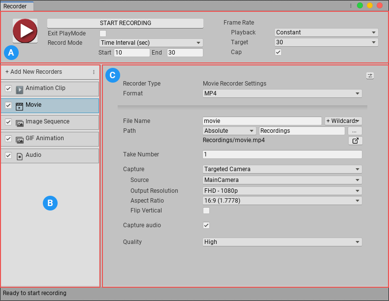

# The Recorder window

Use the Recorder window to manage Recorders and record Play-mode data .

Open the Recorder window from Unity's main menu (**Window > General > Recorder > Recorder window**).

When you open the **Recorder** window, Unity restores the values from the last recording session.

The Recorder window is not available in standalone Unity Players or builds.

>[!NOTE]
>If you are [recording from a Timeline track](RecordingTimelineTrack.md), you set up Recorders from the **Recorder Clip** properties instead.

The Recorder window has the following sections:

||Section:|Details:|
|-|-|-|
|   | **Recording Controls**  | Start and stop recordings, and specify their duration and frame rate.   See [**Recording in Play mode**](RecordingPlayMode.md) for details.  |
|   | **Recorder list**  | Create and manage Recorders.   See [**Creating and managing Recorders**](RecorderManage.md) for details.  |
|   | **Recorder properties**  | Specify recording properties, such as file name and location, output format, and encoding.  See [**Setting Recorder properties**](RecorderProperties.md) for information about properties common to all Recorders.  See the following sections for information about specific Recorder types. - [**Configuring Animation Clip Recorders**](RecorderAnimation.md) - [**Configuring Movie Recorders**](RecorderMovie.md) - [**Configuring Image Sequence Recorders**](RecorderImage.md) - [**Configuring GIF Animation Recorders**](RecorderGif.md) - [**Configuring Audio Recorders**](RecorderAudio.md)  |