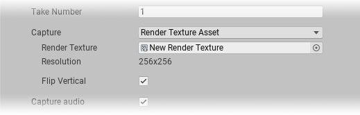

### Render Texture Asset capture properties

These options appear when you set **Capture** to **Render Texture Asset**.

|Property:||Function|
|-|-|-|
|Render Texture   |   | Points to the render texture you want the Recorder to capture.  |
|Resolution   |   | The target render texture's resolution. Unity updates this field automatically when you select a render texture.   |
| **Flip Vertical** ||When you enable this option, the Recorder flips the output image vertically.   This is useful to correct for systems that output video upside down.|