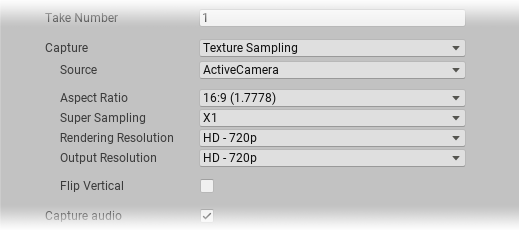

### Texture Sampling capture properties

These options appear when you set **Capture** to **Texture Sampling**.

|Property:||Function|
|-|-|-|
| **Source** ||Specifies which camera the Recorder uses to capture the recording.  **Note:** some options may not appear if you're using certain render pipelines (for example [HDRP](https://docs.unity3d.com/Packages/com.unity.render-pipelines.high-definition@latest)).|
|   | ActiveCamera  | The Camera that is active when you launch the recording.  |
|   | Main Camera   | The Camera tagged with the MainCamera [Tag](https://docs.unity3d.com/Manual/Tags.html).  |
|   | Tagged Camera  | A camera tagged with a specific [Tag](https://docs.unity3d.com/Manual/Tags.html). |
|**Tag**   |   | When you set **Source** to **Tagged Camera**, specifies which Tag to look for.|
| **Aspect Ratio** ||The width:height ratio to format the output to.|
| **Super Sampling**  |   | The size of the grid from which to sample.  |
| **Rendering Resolution** ||The dimensions of the input from which to sample. |
| **Output Resolution** ||The dimensions of the video recording.|