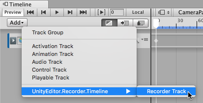

# Recording from a Timeline track

This page explains how to set up and launch a recording from a [Timeline](https://docs.unity3d.com/Manual/TimelineSection.html) Track.

If you want to record from the Recorder window, see [Recording in Play mode](RecordingPlayMode.md).

You can start and stop recordings from Timeline. A **Recorder Track** in Timeline contains one or more **Recorder Clips**. Each clip defines a recording for the Recorder to capture while Timeline plays the **Recorder Track**.

## Setting up Recorder Clips

To set up a recording session in a Timeline instance:

1. Select the GameObject associated with the Timeline Asset.

1. In the Timeline window, click the Add (**+**) button.

1. From the context menu, select **UnityEditor.Recorder.Timeline > Recorder Track**.

1. Right-click the **Recorder Track**.

1. From the context menu, select **Add Recorder Clip**.

1. Select the **Recorder Clip** and edit properties in the **Inspector** window.

## Editing Recorder Clip properties

Recorder Clip properties are the same as regular [Recorder properties](RecorderProperties.md), but you set them from the Recorder Clip inspector rather than the Recorder window.

|||
|-|-|
|   | Choose the type of Recorder you want the Recorder Clip to use. |
|   | Load any existing [Recorder Preset](RecorderManage.md#RecorderPreset), or save the current Recorder Clip settings as a Preset.  |
|   | Set the Recorder Clip properties. These vary according to the **Selected Recorder** setting. You set them the same way you set regular [Recorder properties](RecorderProperties.md). |

>[!NOTE]
> Unity stores the **Recorder Clip** properties in the Timeline Track. They do not affect properties you set in the Recorder window.  

The Recorder Clip Inspector also includes a subset of the [recording controls](RecordingPlayMode.md#setting-up-a-recording) in the Recorder window.

|||
|-|-|
|   | The Recorder Clip's **Clip Timing** properties control the recording's **Start**, **End**, and **Duration**.  |
|   | The **Frame Rate > Playback** property is locked to **Constant** mode, because Timeline plays back at a constant frame rate.  |
|   | The Recorder Clip inherits its **Frame Rate > Target** setting from the Timeline’s **Frame Rate** setting.  |
